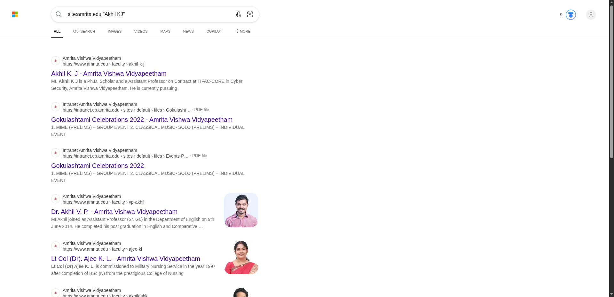

# Day 1 – OSINT Workflow  
## Google Dorking, Search Engines & Publicly Available Resources  

---

## 1. Objective  

In this task, I performed Open-Source Intelligence (OSINT) using Google Dorking techniques. The main objective was to understand how search engines work and how different search operators can be used to refine queries step by step.

Instead of relying on normal searching, I focused on extracting accurate, relevant, and publicly available information by applying structured search techniques. This helped in reducing irrelevant data and improving the quality of results.

---

## 2. Target  

- **Primary Target:** Akhil KJ  
- **Reference Domain:** amrita.edu  

---

## 3. Tools Used  

- Google Search Engine  
- DuckDuckGo  
- Bing  

---

## 4. Workflow  

---

## Step 1: Performing a Normal Search  

**Query I used:**  
Akhil KJ  

**Tool I used:**  
Google  

**What I did:**  
I started with a simple search without applying any filters or operators. The purpose of this step was to observe how general search results appear when no refinement is applied.

**Screenshot:**  

**What I observed:**  
- A large number of results were displayed  
- Many results were not related to the intended target  
- Some results matched only part of the name (either “Akhil” or “KJ”)  
- Profiles from multiple domains such as LinkedIn, hospital records, and unrelated websites appeared  

**What I understood:**  
This step showed that normal searching produces a lot of noise (irrelevant data). It is useful only for initial exploration but not suitable for accurate OSINT analysis.

---

## Step 2: Using Exact Match Search  

**Query I used:**  
"Akhil KJ"  

**Tool I used:**  
Google  

**What I did:**  
I used quotation marks to search for the exact phrase instead of individual keywords.

**Screenshot:**  

**What I observed:**  
- Results became more relevant and focused  
- Only pages containing the exact phrase “Akhil KJ” were displayed  
- Irrelevant and partial matches were significantly reduced  
- Social media profiles and specific mentions appeared  

**What I understood:**  
Using quotes forces the search engine to match the exact phrase, which improves accuracy and reduces unwanted results. This is one of the most basic and effective OSINT techniques.

---

## Step 3: Adding Context to the Search  

**Query I used:**  
"Akhil KJ" "Amrita"  

**Tool I used:**  
Google  

**What I did:**  
I added an additional keyword (“Amrita”) to connect the target with a specific organization.

**Screenshot:**  

**What I observed:**  
- Results were filtered based on both the name and the organization  
- Links related to Amrita Vishwa Vidyapeetham appeared  
- Faculty pages and institutional references were visible  
- It became easier to identify the correct individual  

**What I understood:**  
Adding contextual keywords helps in narrowing down results and improves identification accuracy, especially when multiple people share the same name.

---

## Step 4: Searching Within a Specific Website  

**Query I used:**  
site:amrita.edu "Akhil KJ"  

**Tool I used:**  
Google  

**What I did:**  
I used the `site:` operator to restrict the search to a specific domain.

**Screenshot:**  

**What I observed:**  
- All results were limited to the amrita.edu domain  
- Official pages such as faculty directories and profiles appeared  
- Information was more structured and reliable  

**What I understood:**  
The `site:` operator is useful for verifying information from trusted sources. It ensures that results come only from a specific organization, making the data more credible.

---

## Step 5: Finding Documents Using Filetype  

**Query I used:**  
"Akhil KJ" filetype:pdf  

**Tool I used:**  
Google  

**What I did:**  
I used the `filetype:` operator to search for specific types of documents (PDF in this case).

**Screenshot:**  

**What I observed:**  
- PDF documents such as reports, academic papers, and lists were found  
- Some documents contained structured and detailed information  
- Information inside PDFs was not always visible in normal search results  

**What I understood:**  
Filetype searching helps in discovering hidden or less visible information stored in documents. These documents often contain valuable data for OSINT investigations.

---

## Step 6: Discovering Email Information  

**Query I used:**  
site:amrita.edu "@amrita.edu"  

**Tool I used:**  
Google  

**What I did:**  
I searched for email addresses within the domain to understand the organization’s email structure.

**Screenshot:**  

**What I observed:**  
- Multiple email IDs were visible on web pages  
- A consistent email format (pattern) was identified  
- Contact and faculty pages were displayed  

**What I understood:**  
This technique helps in identifying email formats used by an organization, which can be useful for further investigation or enumeration.

---

## Step 7: Using Multiple Keywords  

**Query I used:**  
"Akhil KJ" "Amrita" "Cyber Security"  

**Tool I used:**  
Google  

**What I did:**  
I combined multiple keywords to refine the search further.

**Screenshot:**  

**What I observed:**  
- Results were highly specific and relevant  
- Only pages related to Cyber Security and the target appeared  
- Very few unrelated results were present  

**What I understood:**  
Using multiple keywords increases precision and helps in targeting specific information. This is very effective when searching for professionals or domain-specific data.

---

## Step 8: Using Alternative Search Engines  

**Tools I used:**  
- DuckDuckGo  
- Bing  

**What I did:**  
I performed similar searches on different search engines to compare results.

**Screenshots:**  
  
Using DuckDuckGo  

  
Using Bing  

**What I observed:**  
- Results varied across different search engines  
- Some unique links were found that were not present in Google  
- DuckDuckGo showed less personalized results  

**What I understood:**  
Different search engines use different indexing methods. Using multiple platforms improves coverage and increases the chances of finding additional information.

---

## 5. Conclusion  

From this task, I understood that basic searching is not sufficient for effective OSINT. By applying Google Dorking techniques step by step, I was able to refine search results and extract more accurate and useful information.

Each operator, such as quotes, site filtering, and filetype search, plays a crucial role in improving search precision. Additionally, using multiple search engines helps in discovering information that may not be available in a single platform.

Overall, this exercise demonstrated how structured searching techniques can significantly enhance the efficiency of OSINT investigations.

---

## 6. Practice Note  

For practice, the same techniques can be applied to:  

- crpf.gov.in  
- Any university website  
- Any public organization domain  
