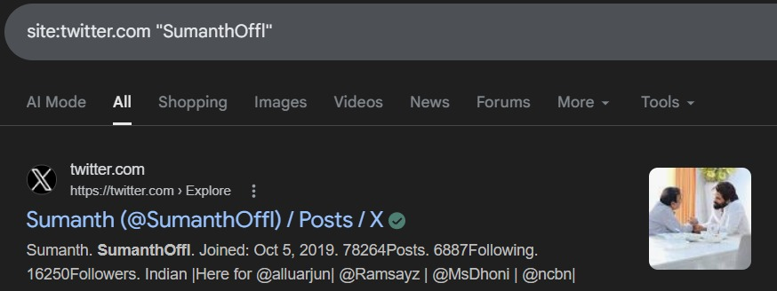
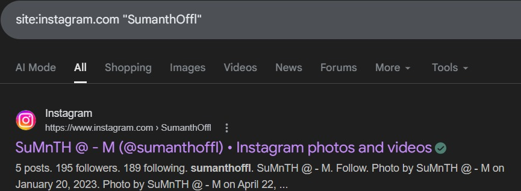
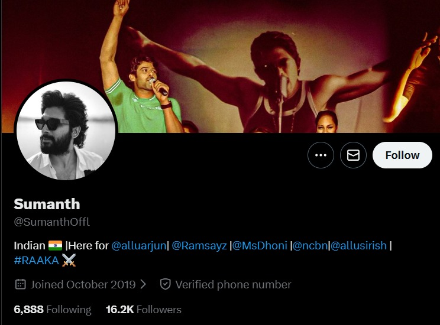

# Day 2 – Social Media Intelligence

## Objective
To identify and analyze user presence across multiple platforms using Profile Intelligence.
For this investigation, the username **"SumanthOffl"** was considered as the target account for analysis. 

---

## Task 1: Platform Discovery 

### Search Query
- site:twitter.com "SumanthOffl"

### Searching Username In Twitter

### Observation
- The username **SumanthOffl** is found on Twitter.
- The search result directly points to a valid profile.

### Analysis
- This confirms that the username exists on Twitter.
- Provides a starting point for further investigation.

### Conclusion
The target username is successfully identified on Twitter, enabling further intelligence collection.

---

## Task 2: Platform Discovery 

### Search Query
- site:instagram.com "SumanthOffl"

### Searching Username In Instagram

### Observation
- The username **SumanthOffl** was not found exactly on Instagram.

### Analysis
- The mismatch indicates that the user may:
  - Use different usernames across platforms 

### Conclusion
Cross-platform inconsistency suggests that identity correlation requires deeper analysis beyond username matching.

---

## Task 3: Profile Intelligence (Twitter Analysis)

### Twitter Profile Analysis

### Data Collected
- Username: SumanthOffl  
- Bio: Includes interests and mentions (@allu arjun, @MsDhoni, @ncbn,@allusirish,@Ramsayz etc.)  
- Profile Image: Visible  
- Followers: 16.2K  
- Following: 6,888  
- Account Created: October 2019  

### Observation
- The profile contains a detailed bio with interests and mentions.
- A profile image is present, indicating a real user account.
- High follower count suggests active presence.

### Analysis
- Bio provides insights into user interests and affiliations.
- Mentions indicate possible connections or influence areas.
- Profile image and activity suggest the account is likely genuine.

### Conclusion
Profile analysis reveals meaningful identity indicators, helping build an initial understanding of the user and supporting further behavioral and network analysis.

---
## Task 3: Behavioral Intelligence

### Data Analyzed
- Posting Date  
- Posting Time  
- Posting Frequency  

---

### Observation
- The user posts content mainly during **specific events** such as movie releases and birthdays of actors.
- Most posts are published between **9:00 AM and 12:00 PM**.
- The account shows **consistent activity**, with approximately **one post per day or one post every two days**.

---

### Analysis
- Event-based posting indicates a strong **interest in the film industry and celebrity-related updates**.
- Consistent posting time suggests a **regular daily routine and stable user behavior**.
- Frequent posting reflects that the account is **actively maintained and engaged**.

---

### Conclusion
The behavioral patterns indicate that the user is **active, consistent, and event-driven** in their posting habits.  
This supports the assumption that the account is **genuine and regularly managed**, making it reliable for further intelligence analysis.

---

## Task 4: Content Intelligence

### Data Analyzed
- Hashtags Used  
- Topics Discussed  
- Type of Content  
- Sentiment  

---

### Observation
- The user frequently uses hashtags such as **#Decoit** (related to movie promotions and theater activity) and **#HappyBirthdayCBN** (for birthday wishes).
- Posts are mainly centered around:
  - Movie releases and updates  
  - Birthday wishes of public figures  
  - Latest news related to actor Allu Arjun  
- Content includes:
  - Movie-related updates  
  - Celebratory posts (birthdays, releases)  
  - Hype or fan-based posts  
- The tone of the posts is consistently **positive**.

---

### Analysis
- Repeated use of movie-related hashtags indicates a strong **interest in the film industry**.
- Frequent posts about specific personalities (e.g., Allu Arjun) indicate a strong personal interest or dedicated following toward those individuals.
- Positive tone across posts reflects **non-hostile and supportive intent**.
- Use of trending and event-based hashtags indicates an attempt to **engage with wider audiences**.

---

### Conclusion
Content analysis shows that the user primarily engages with **entertainment-related topics**, especially movies and celebrity events.  
The consistent use of hashtags and positive tone indicates that the account is **interest-driven, socially active, and focused on public engagement rather than harmful intent**.

---
## Task 5: Cross-Platform Analysis

### Data Compared
- Username consistency  
- Profile image  
- Bio/description  

---

### Observation
- The username **SumanthOffl** was identified on Twitter.
- The same username was **not found on other platforms** like Instagram.
- Due to the absence of matching accounts, profile image and bio comparison could not be performed.

---

### Analysis
- Lack of username consistency across platforms indicates:
  - The user may use different usernames on different platforms, OR  
  - The user has limited presence outside Twitter  
- Absence of cross-platform data reduces the ability to strongly confirm identity linkage.

---

### Conclusion
Differences in platform presence and the absence of matching profile details suggest that **cross-platform identity correlation could not be established** for the target user.

---

## Task 6: Final Conclusion

Based on the analysis of profile, behavioral, and content intelligence:

- The user appears to be an **active, interest-driven social media user**, primarily focused on entertainment-related content.  
- The account shows **consistent activity during morning hours (9 AM – 12 PM)** and posts regularly based on events such as movie releases and birthdays.  
- Content is mainly centered around **movies, celebrity updates, and positive engagement**, especially related to actor Allu Arjun.  
- Platform presence is currently **limited to Twitter**, with no confirmed cross-platform identity linkage.

### Final Statement
The account demonstrates characteristics of a **genuine and actively managed user**, with no strong indicators of malicious or suspicious behavior.

---

