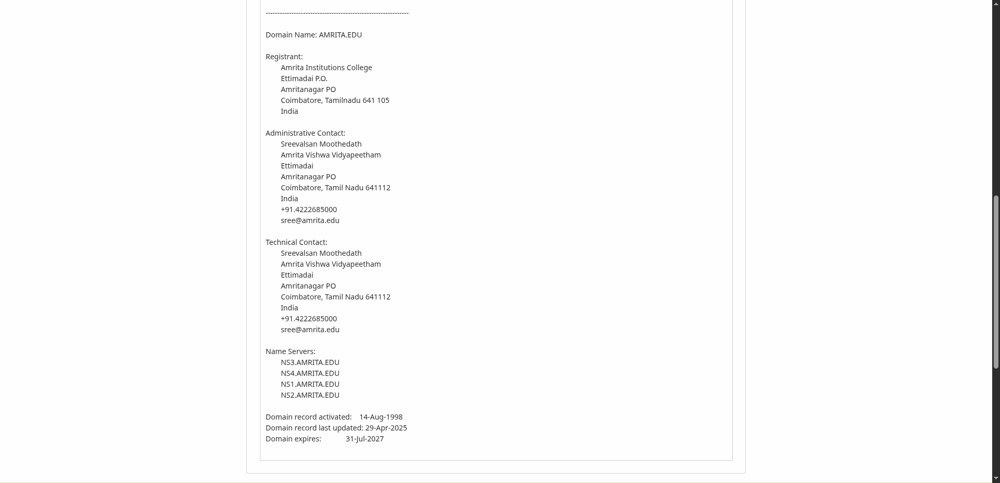
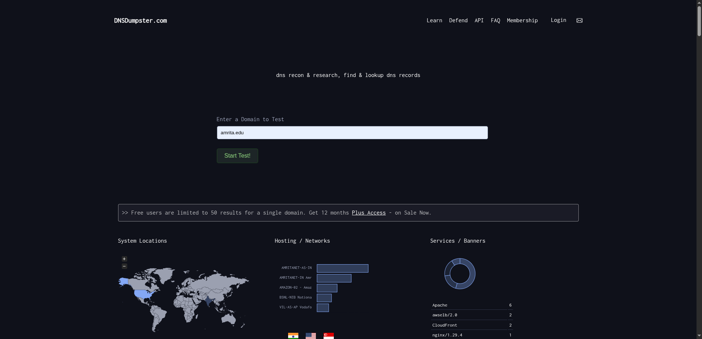
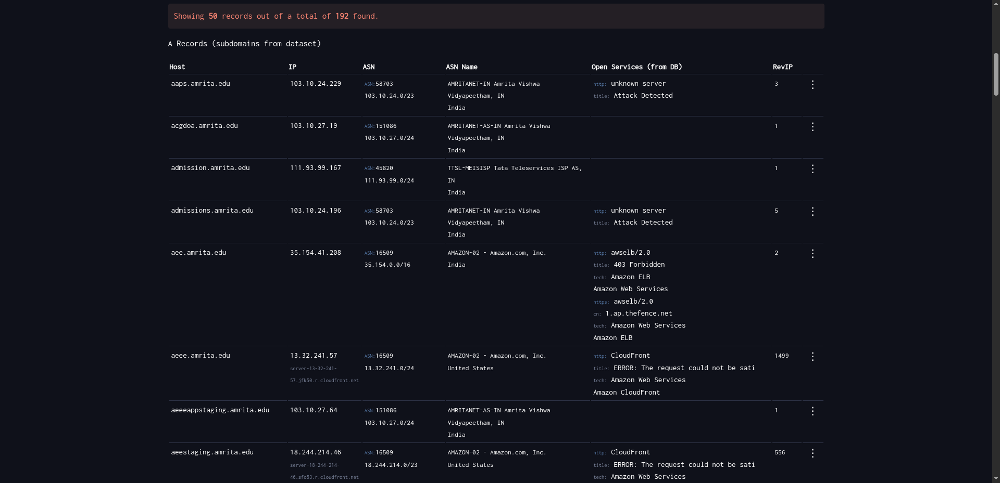
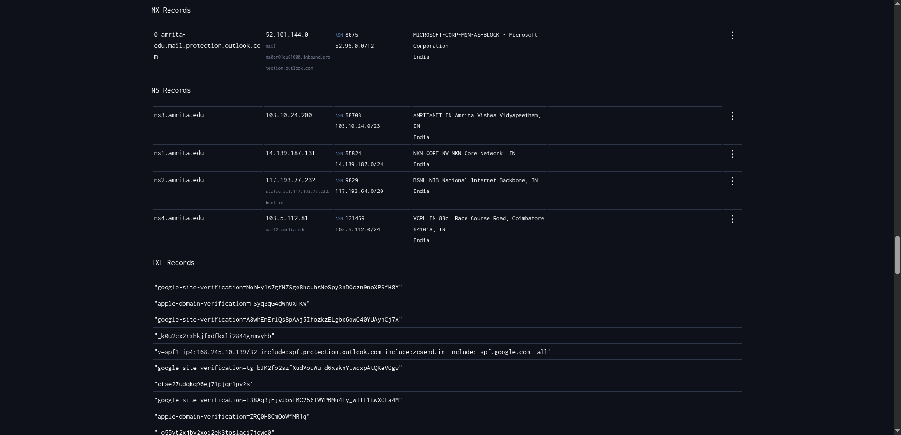
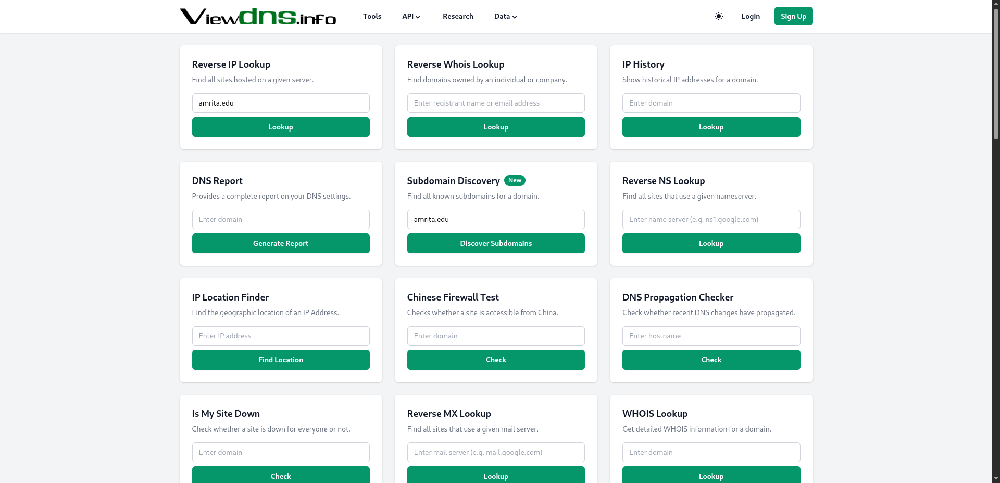
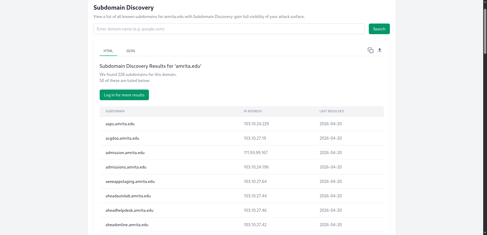
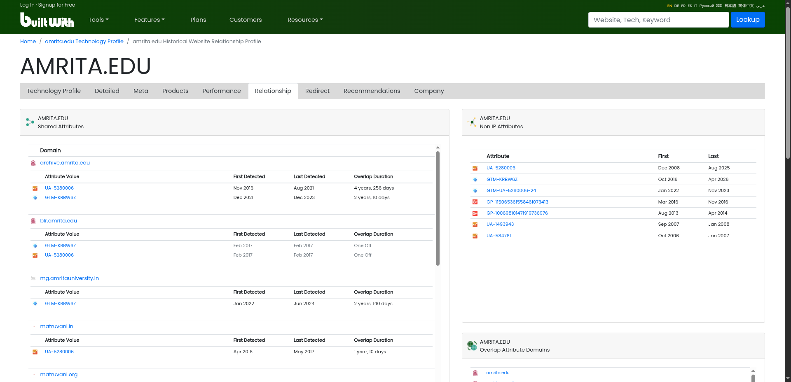
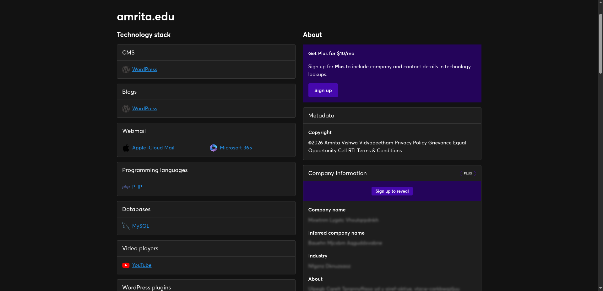
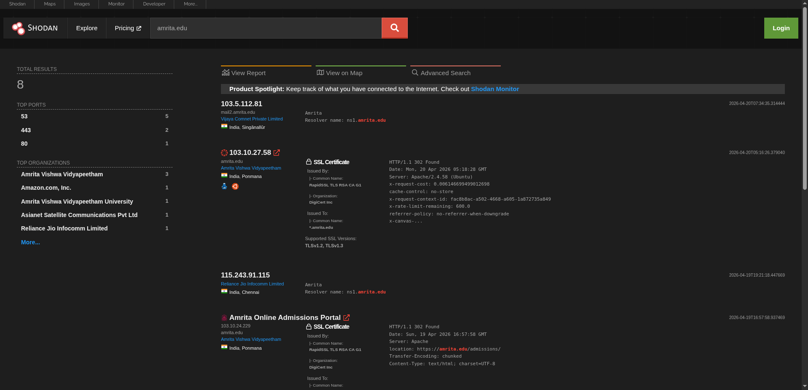

# Day 3 – OSINT Workflow  
## Infrastructure Intelligence (DNS, IP, Domains & Subdomains)

## 1. Objective  

In this task, I performed infrastructure-based OSINT on a target domain. The goal was to understand how a domain is structured internally by analyzing DNS records, IP details, subdomains, and publicly exposed services.

---

## 2. Target  

- **Primary Target:** amrita.edu  

---

## 3. Tools Used  

- WHOIS Lookup (lookup.icann.org)  
- DNSdumpster  
- ViewDNS.info  
- crt.sh  
- BuiltWith  
- Wappalyzer  
- Shodan  

---

## 4. Workflow  

---

## Step 1: Performing WHOIS Lookup  

**Tool I used:**  
lookup.icann.org  

**What I did:**  
I performed a WHOIS lookup to collect registration details of the domain.

**Screenshot:**  

**What I observed from the screenshot:**  
- The domain name **AMRITA.EDU** is clearly shown  
- Registrant details include Amrita Vishwa Vidyapeetham (Coimbatore, India)  
- Administrative and technical contact information is listed  
- Name servers like `ns1.amrita.edu`, `ns2.amrita.edu` are visible  
- Domain creation date and expiry date are also mentioned  

**What I understood:**  
This step gave me basic ownership and registration details, which helps in identifying who manages the domain.

---

## Step 2: Analyzing DNS Records  

**Tool I used:**  
DNSdumpster  

**What I did:**  
I entered the domain and analyzed its DNS records and infrastructure mapping.

**Screenshots:**  
  
  
  

**What I observed from the screenshots:**  
- A world map showing server locations (mostly India and some global services)  
- Hosting providers like Amazon and other networks are visible  
- Subdomains such as `aaps.amrita.edu`, `admissions.amrita.edu` are listed  
- IP addresses are mapped to each subdomain  
- MX records (mail servers) are shown using Microsoft infrastructure  
- NS records confirm authoritative DNS servers  
- TXT records include SPF and verification records  

**What I understood:**  
This step helped me understand how the domain is structured, where it is hosted, and what services (mail, web, etc.) are being used.

---

## Step 3: Identifying IP & Hosting Details  

**Tool I used:**  
ViewDNS.info  

**What I did:**  
I performed reverse IP lookup and checked hosting-related details.

**Screenshot:**  

**What I observed:**  
- Multiple tools like Reverse IP, DNS report, and IP history are available  
- The domain is associated with shared hosting infrastructure  
- Related domains and hosting patterns can be identified  

**What I understood:**  
This step gives insight into the hosting environment and helps identify other domains hosted on the same server.

---

## Step 4: Subdomain Enumeration  

**Tools I used:**  
- crt.sh  
- DNSdumpster  

**Query I used:**  
%.amrita.edu  

**What I did:**  
I searched for subdomains related to the target domain.

**Screenshot:**  

**What I observed:**  
- A large number of subdomains were discovered  
- Examples include `admissions.amrita.edu`, `aaps.amrita.edu`, etc.  
- Each subdomain is mapped with its IP address  
- Last resolved timestamps are also shown  

**What I understood:**  
This step helped me identify the extended surface of the domain, which is important for understanding how many services are exposed.

---

## Step 5: Technology Fingerprinting  

**Tools I used:**  
- BuiltWith  
- Wappalyzer  

**Screenshots:**  
  

**What I did:**  
I analyzed what technologies are being used by the website.

**What I observed:**  
- CMS used: WordPress  
- Backend technologies like PHP  
- Database: MySQL  
- Webmail services like Microsoft 365  
- Additional integrations like YouTube and analytics tools  

**What I understood:**  
This step helped me understand the technology stack, which is useful for identifying possible vulnerabilities or configurations.

---

## Step 6: Shodan Analysis  

**Tool I used:**  
Shodan  

**What I did:**  
I searched for the domain to identify exposed services and open ports.

**Screenshot:**  

**What I observed:**  
- Open ports such as **80 (HTTP)** and **443 (HTTPS)**  
- Server details like Apache  
- SSL certificate information  
- IP addresses and their locations  
- Organization details like Amrita Vishwa Vidyapeetham  

**What I understood:**  
This step helped me identify publicly exposed services and understand how the system is visible from the internet.

---

## 5. Conclusion  

In this workflow, I analyzed the infrastructure of a domain using multiple OSINT tools. Starting from WHOIS, I gathered ownership details, then moved to DNS and IP analysis to understand hosting and services.

Subdomain enumeration helped in identifying additional exposed endpoints, while technology fingerprinting revealed the tech stack used. Finally, Shodan provided insights into publicly exposed services.

Overall, combining these tools gives a complete picture of a domain’s infrastructure and its presence on the internet.

---

## 6. Practice Note  

For further practice, the same process can be applied to:  

- crpf.gov.in  
- Any government or university domain  

---
