# Day 4 – OSINT Workflow
## Identity Intelligence (Person Profiling & Correlation)

## 1. Objective
To perform identity-based OSINT investigation by starting from a single data point (email/username) and expanding it to identify associated accounts, breaches, usernames, and real-world connections.

## 2. Target
Primary Target: (Own email / username used for analysis)

## 3. Tools Used
- Holehe
- SpiderFoot
- Sherlock
- Social Analyzer
- PhoneInfoga
- Recon-ng

## 4. Workflow

### Step 1: Email → Account Discovery

**Tool Used:** Holehe  

**Purpose:** Identify platforms where the email is registered  

**Screenshot:**
  
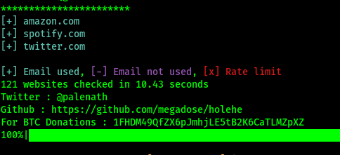

**Observation:**
- Multiple platform checks performed
- Some accounts identified

**Result:**
Initial footprint of the target established

### Step 2: Email → Breach & Leak Analysis

**Tool Used:** SpiderFoot  

**Purpose:** Check for breach data and leaks  

**Screenshot:**
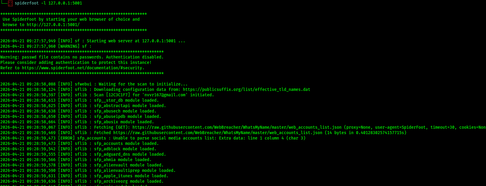  
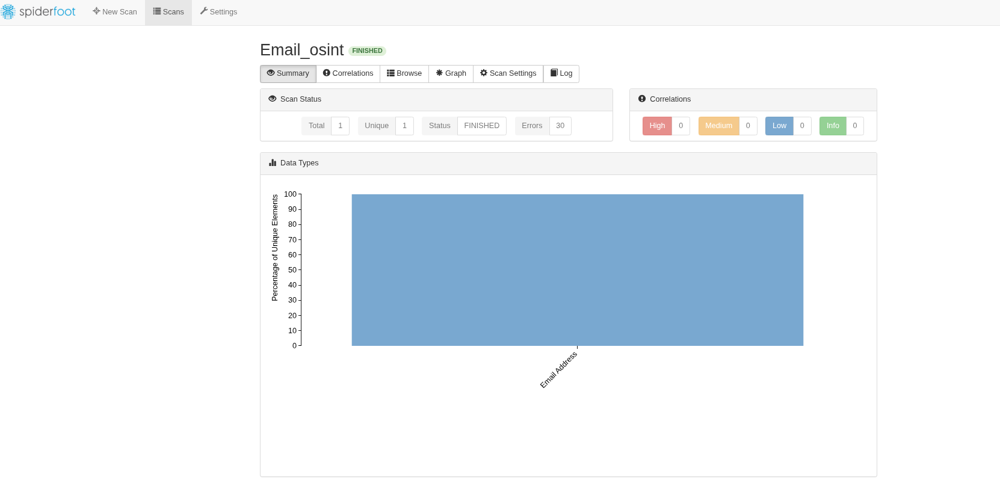

**Observation:**
- Scan initiated and modules executed
- Data sources analyzed

**Result:**
Possible exposure insights gathered

### Step 3: Username Derivation

**Technique Used:** Manual  

**Example:**
- username  
- username123  
- name_variation  

**Observation:**
- Multiple variations prepared

**Result:**
Used for further enumeration

### Step 4: Username Enumeration

**Tool Used:** Sherlock  

**Screenshot:**
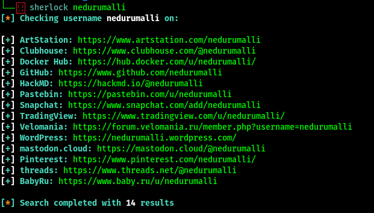

**Observation:**
- Accounts found on various platforms
- Some usernames not available

**Result:**
Cross-platform identity mapping

### Step 5: Advanced Username Search

**Tools Used:**
- WhatsMyName
- Social Analyzer  

**Screenshot:**
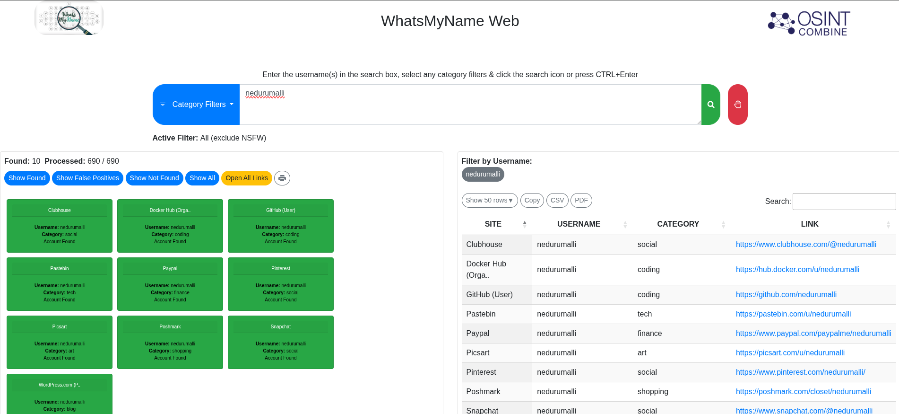  
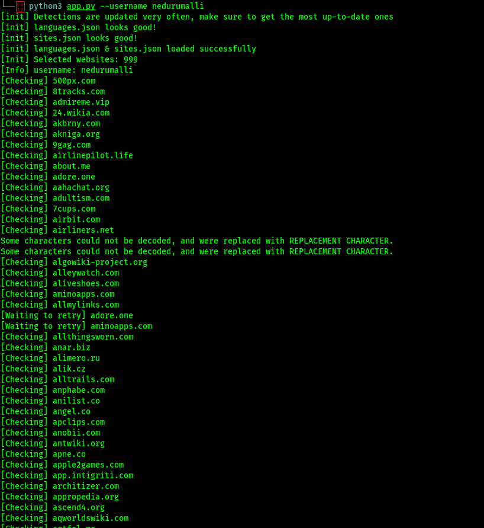  
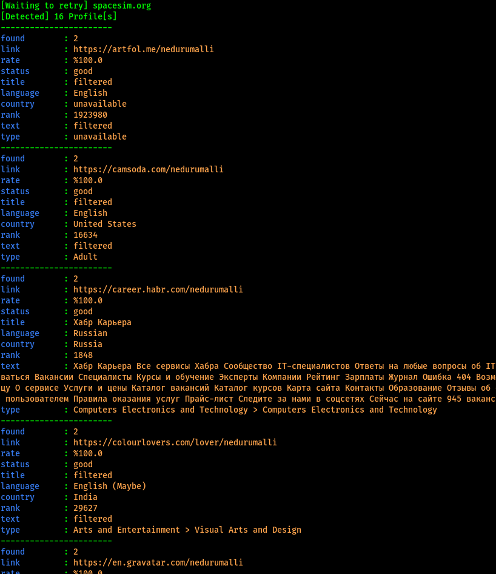

**Observation:**
- Additional platforms discovered
- Broader coverage achieved

**Result:**
Improved identity tracking

### Step 6: Deleted Profile Recovery

**Technique Used:** Google Dorking  

**Screenshot:**

**Observation:**
- Cached or indexed results checked

**Result:**
Attempt to retrieve historical data

### Step 7: Phone Number Intelligence

**Tool Used:** PhoneInfoga  

**Screenshot:**
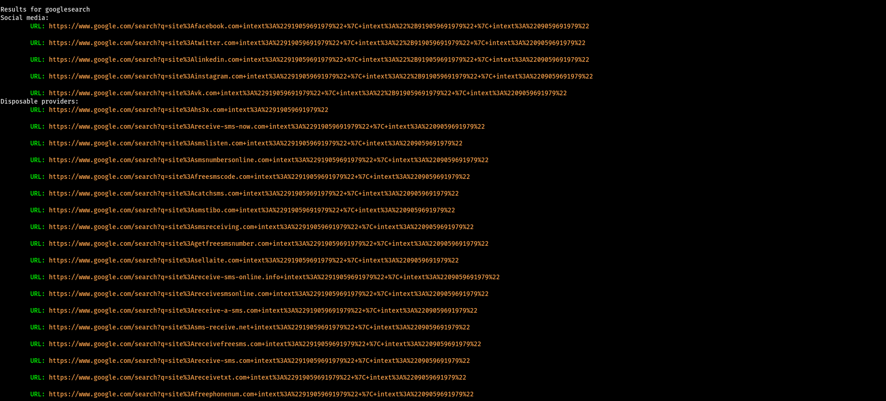

**Observation:**
- Carrier and region details identified

**Result:**
Additional identity linkage

### Step 8: Automated OSINT Collection

**Tool Used:** Recon-ng  

**Screenshot:**
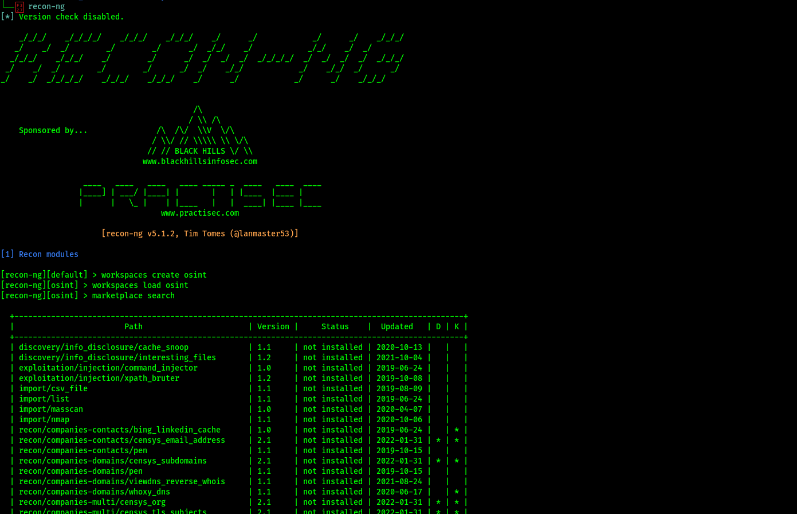  
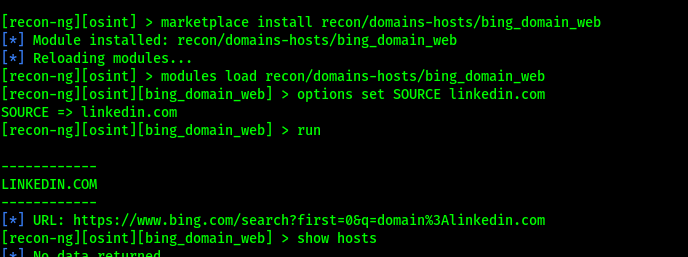

**Observation:**
- Automated modules executed
- Aggregated intelligence collected

**Result:**
Faster intelligence gathering

### Step 9: Correlation & Analysis

**Technique Used:** Manual Correlation  

**Observation:**
- Matching usernames across platforms
- Consistent patterns observed

**Result:**
Identity relationships established

### Step 10: Final Visualization

**Tool Used:** SpiderFoot  

**Screenshot:**
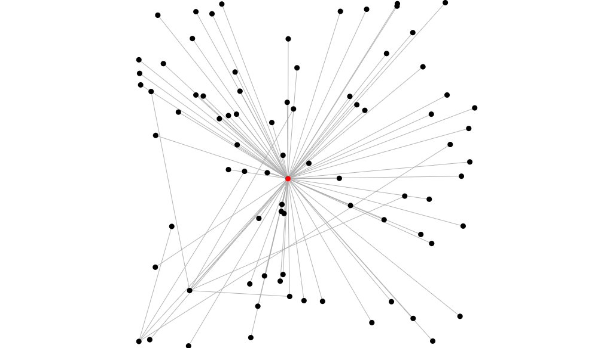

**Observation:**
- Nodes and connections mapped

**Result:**
Clear visual representation of identity network

## 5. Conclusion

Identity intelligence enables investigators to build a complete profile by correlating data from multiple sources. Using various OSINT tools improves accuracy and helps uncover hidden connections across platforms.

## 6. Ethical Note

- Only use authorized or personal data  
- Avoid investigating private individuals without permission  
- Follow ethical OSINT practices
