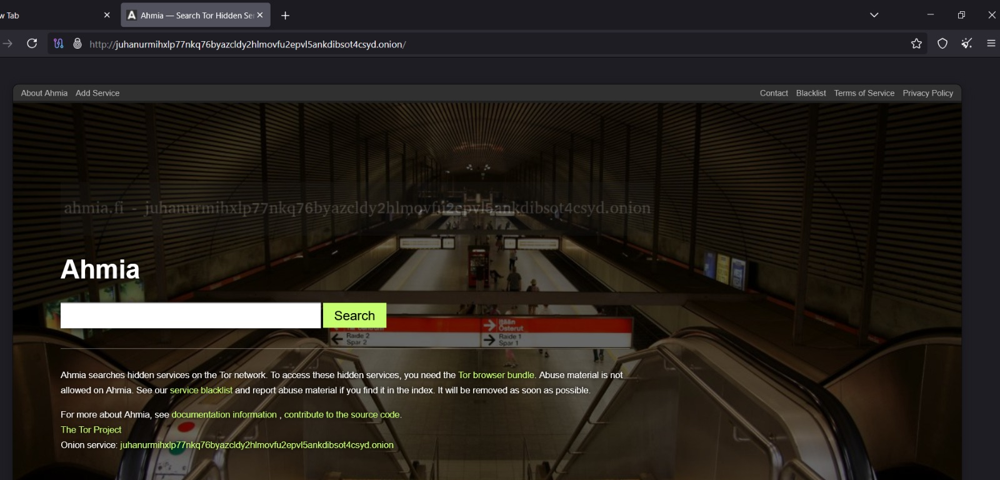
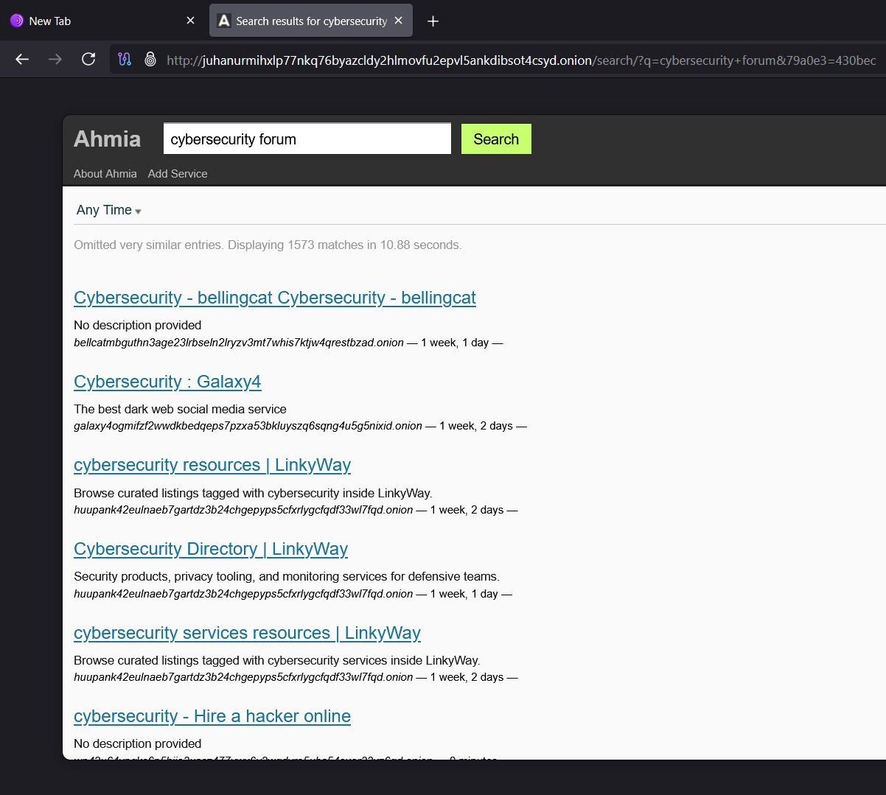
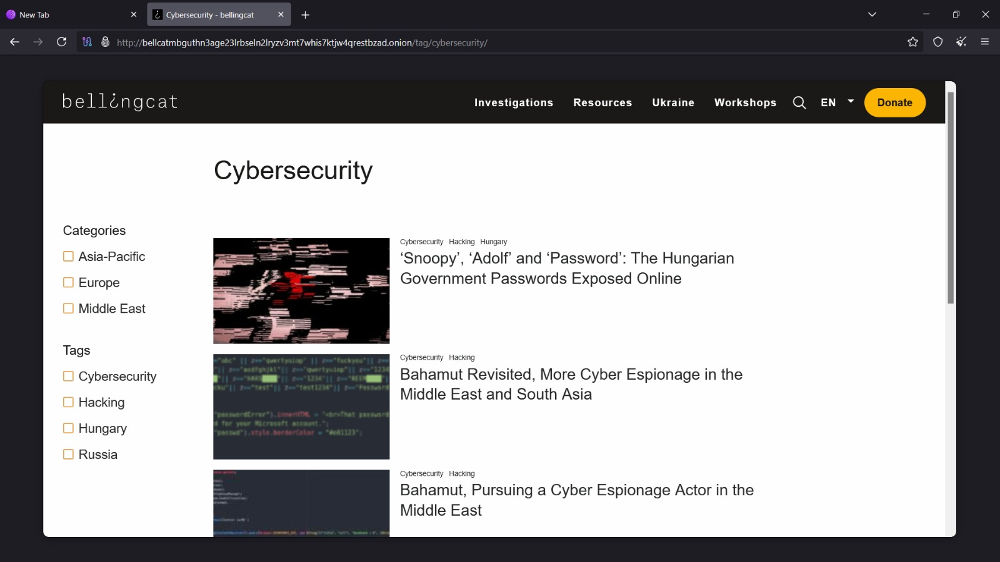
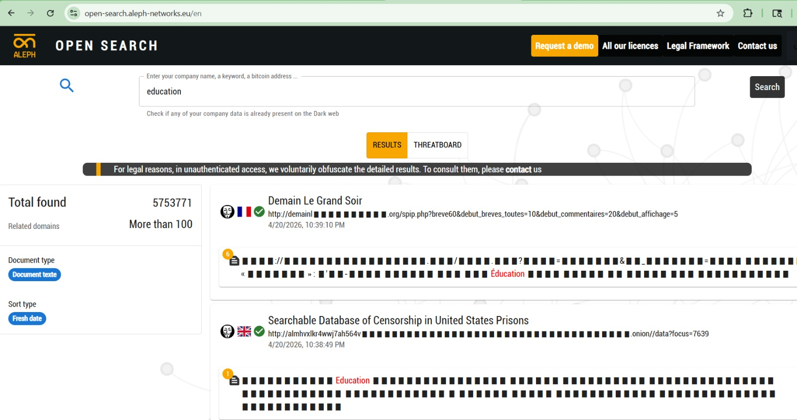
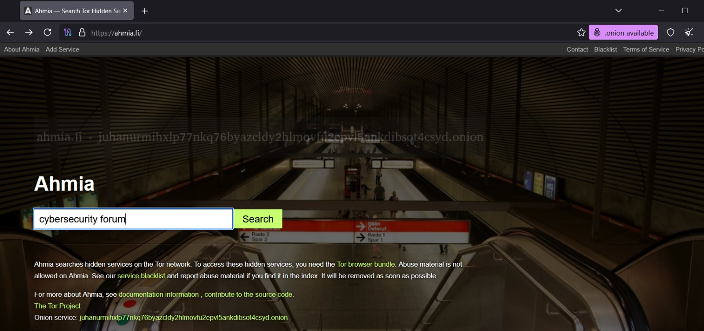
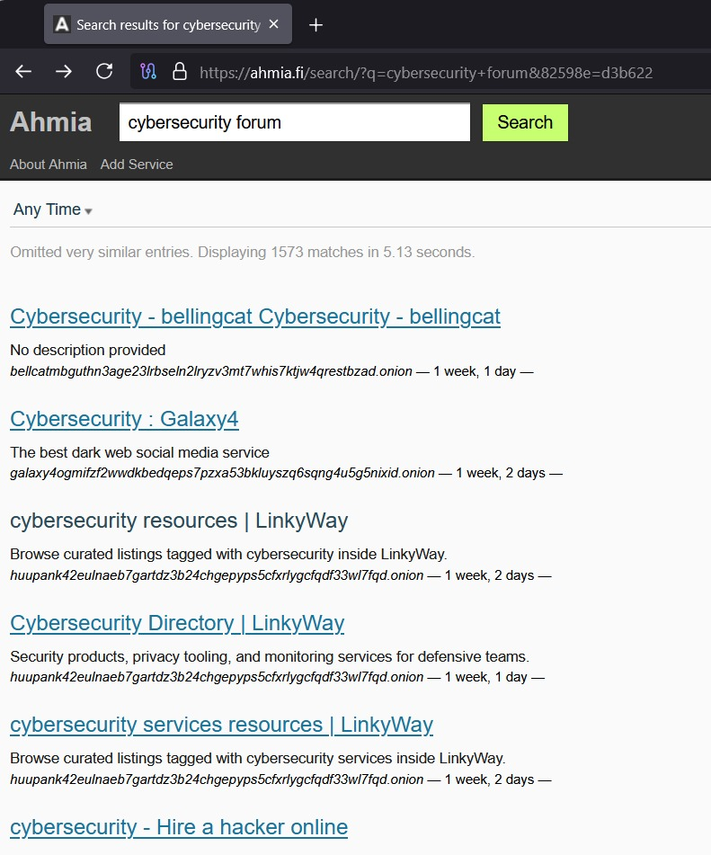
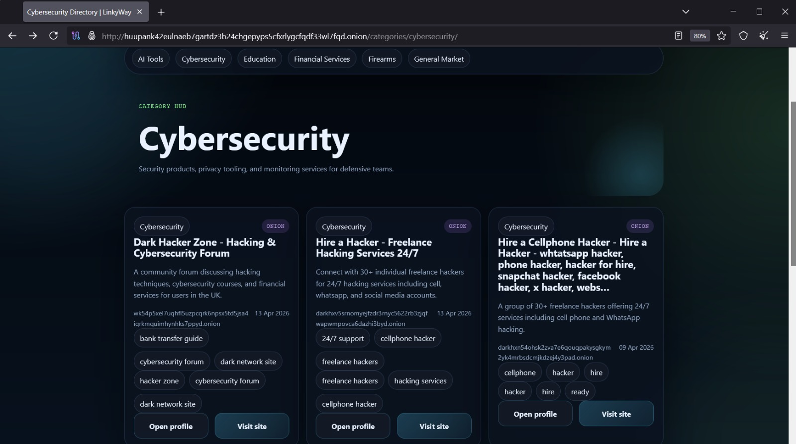

# Day 6 - Dark Web Intelligence

## Task 1: Dark Web Search Engine Usage

### Objective:
To identify hidden services on the dark web using search engines.

---

## Ahmia Search Engine Interface:
Ahmia search engine homepage opened using Tor Browser.

Observation:
- Ahmia is a dark web search engine used to discover .onion websites.  
- It requires Tor Browser for accessing hidden services.

---

## Keyword Search Execution:
Keyword search performed.

## Observation:
- The keyword "cybersecurity forum" is entered to identify relevant dark web platforms.  
- This helps in locating forums and discussion-based hidden services.

---

## Search Results with .onion Links:
Search results showing .onion links.

## Observation:
- Multiple .onion links are displayed as search results.  
- These links represent hidden services such as forums, directories, and cybersecurity-related resources.  
- Some links may be inactive or inaccessible, which is common in the dark web environment.

---

## Analysis:

- The results indicate that dark web search engines can be used to discover hidden platforms related to specific topics.  

- The presence of multiple cybersecurity-related links suggests the availability of forums and knowledge-sharing platforms on the dark web.  

- Not all links are guaranteed to work, highlighting the unstable and dynamic nature of dark web services.

---

## Conclusion:

- Dark web search engines like Ahmia help in identifying hidden services that are not accessible through regular search engines.  

- The use of .onion links confirms that these services operate within the Tor network, ensuring anonymity and restricted access.

## TASK 2: ONION LINK ANALYSIS

### Step-by-Step process
- Selected a safe-looking onion link (avoided marketplaces)
- Opened the link using Tor Browser
- Waited for the page to load successfully

---

## Accessed Cybersecurity Onion Website:
Opened website homepage

---

### Observation:

- The selected onion site appears to be an **information portal/blog**.

- The site is **active** and contains **cybersecurity-related articles and investigative content**.

- The homepage shows:
  - Multiple **articles related to cybersecurity and hacking**
  - Categories such as **Asia-Pacific, Europe, and Middle East**
  - Tags including **Cybersecurity, Hacking, Hungary, and Russia**
  - Navigation sections like **Investigations, Resources, and Workshops**

- The website layout is **well-organized and similar to a normal surface web news site**.

- The page loaded successfully, although with slight delay, which is normal for Tor network.

- No login page or restricted access was observed, indicating the content is **publicly accessible**.

---

### Result:

- Successfully accessed and analyzed a working onion website
- Identified that the site is an **informational cybersecurity blog**
- Observed that dark web sites can also host **legitimate and structured content**
- Verified that Tor browsing may be slower but functional

---
## TASK 3: DATA SEARCH USING ALEPH

### Step-by-Step
- Opened a normal web browser (not Tor)
- Navigated to Aleph Open Search platform
- Entered the keyword **"education"** in the search bar
- Viewed the generated results

---

## Aleph Open Search – Results View:
Search results page

---

### Observation:

- The search results include **structured data such as documents, domain names, and organizational records**.

The platform displays:
- **Indexed documents** from various sources  
- **Domain-related information** (e.g., websites and databases)  
- **Timestamps and metadata** for each result  
- Indicators showing **data source and country origin**

The left panel provides filtering options such as:
- Document type (e.g., text documents)  
- Sort type (e.g., fresh/latest data)  
- Related domains count  

Some parts of the data are **obfuscated (hidden)** due to legal restrictions, indicating controlled access to sensitive datasets.

The interface is **professional and investigative in nature**, designed for data analysis and intelligence gathering.

The results include both **surface web and dark web (.onion) sources**, showing cross-platform data indexing.

---

### Result:

- Successfully performed a data search using Aleph Open Search
- Identified that the platform provides **structured and categorized intelligence data**
- Observed presence of **documents, records, and domain-related information**
- Noted that some data is restricted due to **legal and privacy considerations**
---

## TASK 4: FORUM INTELLIGENCE

### Step-by-Step process
- Opened Ahmia search engine using Tor Browser  
- Searched for **"cybersecurity forum"**  
- Observed multiple onion links in the search results  
- Selected a safe and relevant link  
- Opened the link and analyzed the content  

---

## Ahmia Search Engine – Query Input:
Ahmia search homepage with query

---

## Ahmia Search Results for Cybersecurity Forums:
Search results showing multiple cybersecurity-related onion links

---

## Cybersecurity Forum Page (.onion):
Opened cybersecurity forum/directory page

---

### Observation:

The search results display multiple **cybersecurity-related forums, directories, and resources** available on the dark web.

The selected onion site appears to be a **forum/directory hub** that provides access to different cybersecurity communities.

The page contains:
- Listings related to **cybersecurity discussions and hacking forums**
- Categories such as **Cybersecurity, AI Tools, Education, Financial Services**
- Tags like **cybersecurity forum, hacker zone, dark network site**

Each entry includes:
- A brief **description of the forum or service**
- **Tags and classifications**
- Options like **"Open profile"** and **"Visit site"**

The content indicates:
- Availability of **discussion-based platforms**
- Information related to **cybersecurity topics and services**

User interaction can be inferred through:
- Multiple categorized listings  
- Updated entries with timestamps  
- Structured tagging system  

The pages loaded successfully, though slightly slow due to Tor network latency.

---

### Result:

- Successfully searched and identified forum-related onion sites using Ahmia
- Accessed a cybersecurity-related forum/directory page
- Observed that dark web forums may exist as **discussion platforms or directory hubs**
- Identified presence of **cybersecurity topics, resources, and community listings**
- Understood how information and communities are organized in the dark web environment  
---
## TASK 5: BREACH / LEAK DATA UNDERSTANDING

Observation:

- Commonly exposed data on the dark web includes email addresses, usernames, phone numbers, and organizational details.
- In some cases, leaked datasets may also contain passwords (hashed or plain), internal documents, or database records.

Analysis:

- This type of data is highly sensitive and poses serious risks if misused.
- Attackers can use this information for phishing attacks, identity theft, credential stuffing, or unauthorized system access.

---

## TASK 6: COMPARISON WITH SURFACE WEB

Observation:

- Surface web search engines (like Google, Bing) index publicly accessible websites and provide structured, filtered results.
- In contrast, dark web content is not indexed by traditional search engines and requires specialized tools like Tor and Ahmia for access.

Analysis:

- Dark web results often include hidden services, private forums, and sensitive datasets that are not available on the surface web.
- This makes the dark web a unique source for intelligence gathering, but also increases complexity and risk.

---

## TASK 7: RISK ANALYSIS

Observation:

- Exposure on the dark web can lead to serious cybersecurity risks including data breaches, identity theft, and targeted attacks.

Analysis:

- Individuals may face account compromise, financial loss, or privacy violations.
- Organizations may experience reputational damage, data leaks, and security incidents.

Preventive Measures:

- Strong password policies
- Multi-factor authentication (MFA)
- Regular monitoring for data breaches
- Encryption of sensitive data

---

## TASK 8: LEGAL & ETHICAL UNDERSTANDING

Observation:

- Dark web investigations must follow strict legal and ethical guidelines.

Guidelines:

- Only access and analyze publicly available information.
- Do not download, share, or interact with illegal or sensitive content.
- Avoid creating accounts, making transactions, or engaging with unknown entities.
- Always use a secure environment (such as a Virtual Machine) to reduce risk.

